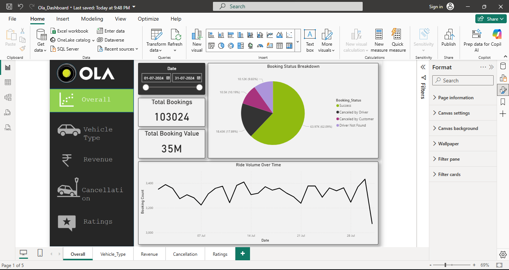
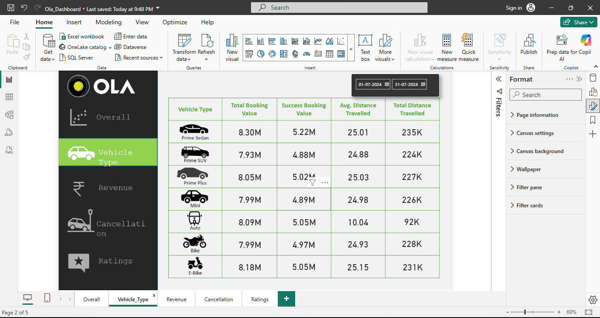
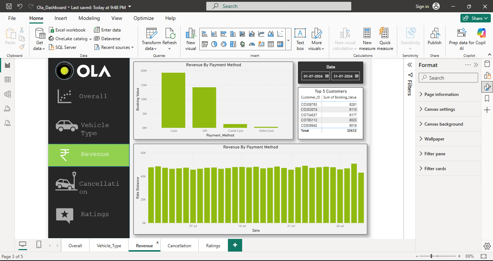
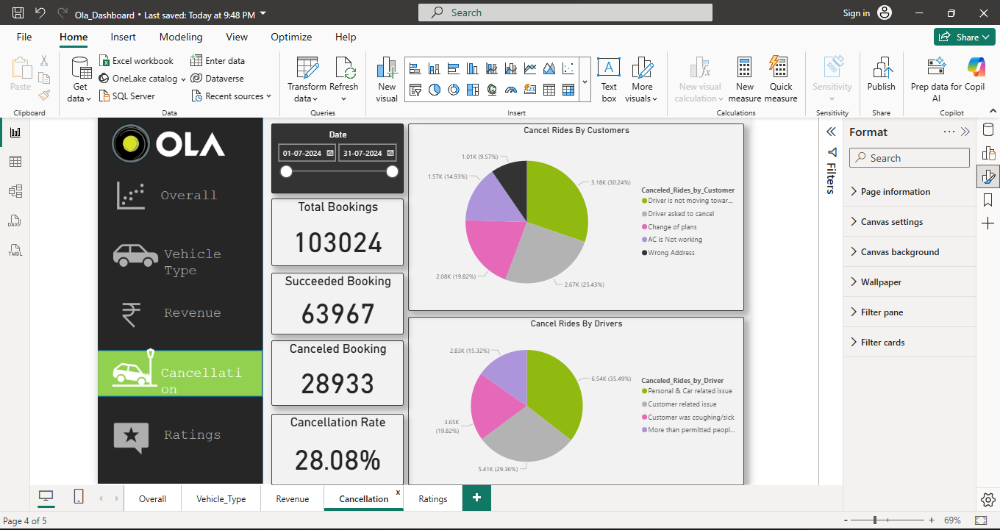
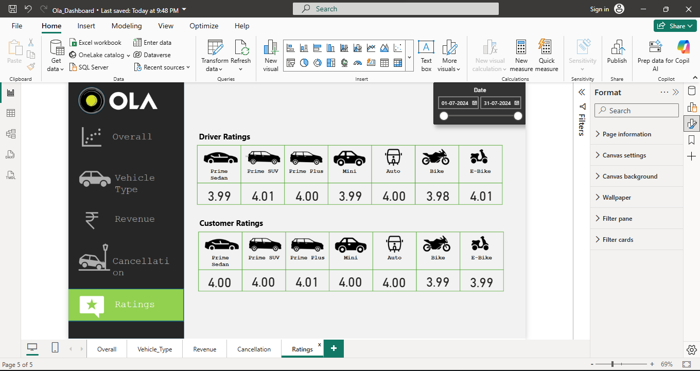

# OLA Data Analytics Project

## Project Overview

This project analyzes OLA ride booking data using Python, SQL, and Power BI.

The project includes:

* Data Cleaning
* Exploratory Data Analysis (EDA)
* SQL Queries
* Interactive Power BI Dashboard
* Business Insights

---

## Tools & Technologies Used

* Python
* Pandas
* NumPy
* Matplotlib
* SQL
* Power BI
* Jupyter Notebook

---

## Dataset

The dataset contains 100000+ OLA ride booking records.

---

## Key Insights

* Ride success and cancellation analysis
* Vehicle type performance
* Revenue analysis
* Driver ratings analysis
* Booking trends

---

## Project Files

* `ola_eda.ipynb` → Python EDA Notebook
* `Booking.sql` → SQL Queries
* `Ola_Dashboard.pbix` → Power BI Dashboard
* `.png files` → Dashboard Screenshots

---

## Dashboard Preview

### Overview

### Vehicle Type Analysis

### Revenue Analysis

### Cancellation Analysis

### Ratings Analysis

---

## Author

Harish Kokate
